<p align="center">
  
</p><p align="center">
  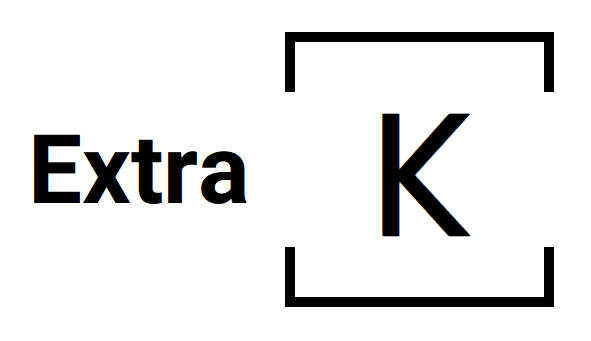
</p>
<p align="center"><b>📃🎉 Additional datasets for <code>tensorflow.keras</code></b></p>
<p align="center">Powered by MachineCurve at www.machinecurve.com 🚀</p>
<p align="center"></p>

Hi there, and welcome to the `extra-keras-datasets` module! This extension to the original `tensorflow.keras.datasets` module offers easy access to additional datasets, in ways almost equal to how you're currently importing them.


## Table of Contents
- [Table of Contents](#table-of-contents)
- [How to use this module?](#how-to-use-this-module-)
  * [Dependencies](#dependencies)
  * [Installation procedure](#installation-procedure)
- [Datasets](#datasets)
  * [EMNIST-Balanced](#emnist-balanced)
  * [EMNIST-ByClass](#emnist-byclass)
  * [EMNIST-ByMerge](#emnist-bymerge)
  * [EMNIST-Digits](#emnist-digits)
  * [EMNIST-Letters](#emnist-letters)
  * [EMNIST-MNIST](#emnist-mnist)
  * [KMNIST-KMNIST](#kmnist-kmnist)
  * [KMNIST-K49](#kmnist-k49)
  * [SVHN-Normal](#svhn-normal)
  * [SVHN-Extra](#svhn-extra)
  * [STL-10](#stl-10)
  * [Iris](#iris)
- [Contributors and other references](#contributors-and-other-references)
- [License](#license)

## How to use this module?
### Dependencies
**Make sure to install TensorFlow!**
This package makes use of the TensorFlow 2.x package and specifically `tensorflow.keras`. Therefore, make sure to install TensorFlow - you can do so in the following way:

* `pip install tensorflow`

### Installation procedure
Installing is really easy, and can be done with [PIP](https://pypi.org/project/extra-keras-datasets/): `pip install extra-keras-datasets`.

## Datasets

### EMNIST-Balanced
Extended MNIST (EMNIST) contains digits as well as uppercase and lowercase handwritten letters. `EMNIST-Balanced` contains 131.600 characters across 47 balanced classes.

```
from extra_keras_datasets import emnist
(input_train, target_train), (input_test, target_test) = emnist.load_data(type='balanced')
```

<a href="./assets/emnist-balanced.png"></a>

---

### EMNIST-ByClass
Extended MNIST (EMNIST) contains digits as well as uppercase and lowercase handwritten letters. `EMNIST-ByClass` contains 814.255 characters across 62 unbalanced classes.

```
from extra_keras_datasets import emnist
(input_train, target_train), (input_test, target_test) = emnist.load_data(type='byclass')
```

<a href="./assets/emnist-byclass.png">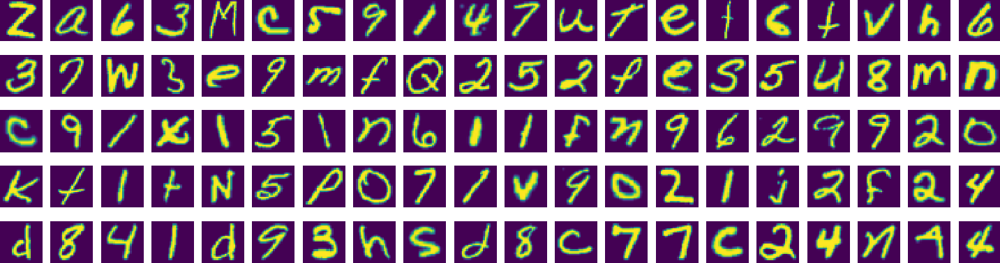</a>

---

### EMNIST-ByMerge
Extended MNIST (EMNIST) contains digits as well as uppercase and lowercase handwritten letters. `EMNIST-ByMerge` contains 814.255 characters across 47 unbalanced classes.

```
from extra_keras_datasets import emnist
(input_train, target_train), (input_test, target_test) = emnist.load_data(type='bymerge')
```

<a href="./assets/emnist-bymerge.png">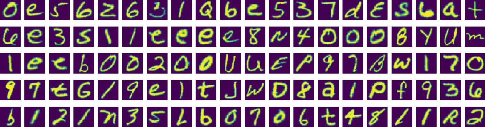</a>

---

### EMNIST-Digits
Extended MNIST (EMNIST) contains digits as well as uppercase and lowercase handwritten letters. `EMNIST-Digits` contains 280.000 characters across 10 balanced classes (digits only).

```
from extra_keras_datasets import emnist
(input_train, target_train), (input_test, target_test) = emnist.load_data(type='digits')
```

<a href="./assets/emnist-digits.png">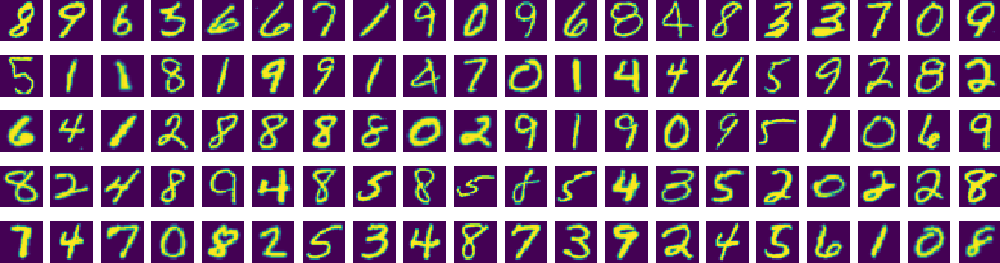</a>

---

### EMNIST-Letters
Extended MNIST (EMNIST) contains digits as well as uppercase and lowercase handwritten letters. `EMNIST-Letters` contains 145.600 characters across 26 balanced classes (letters only).

```
from extra_keras_datasets import emnist
(input_train, target_train), (input_test, target_test) = emnist.load_data(type='letters')
```

<a href="./assets/emnist-letters.png">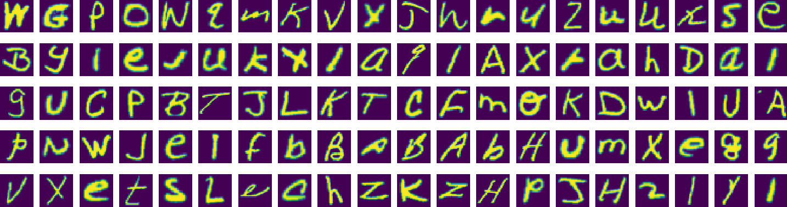</a>

---

### EMNIST-MNIST
Extended MNIST (EMNIST) contains digits as well as uppercase and lowercase handwritten letters. `EMNIST-MNIST` contains 70.000 characters across 10 balanced classes (equal to `keras.datasets.mnist`).

```
from extra_keras_datasets import emnist
(input_train, target_train), (input_test, target_test) = emnist.load_data(type='mnist')
```

<a href="./assets/emnist-mnist.png">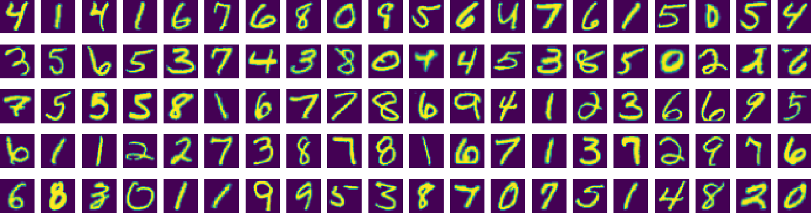</a>

---

### KMNIST-KMNIST
Kuzushiji-MNIST is a drop-in replacement for the MNIST dataset: it contains 70.000 28x28 grayscale images of Japanese Kuzushiji characters.

```
from extra_keras_datasets import kmnist
(input_train, target_train), (input_test, target_test) = kmnist.load_data(type='kmnist')
```

<a href="./assets/kmnist-kmnist.png">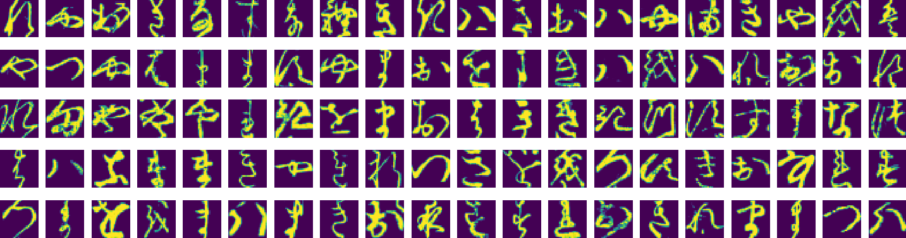</a>

---

### KMNIST-K49
Kuzushiji-49 extends Kuzushiji-MNIST and contains 270.912 images across 49 classes.

```
from extra_keras_datasets import kmnist
(input_train, target_train), (input_test, target_test) = kmnist.load_data(type='k49')
```

<a href="./assets/kmnist-k49.png">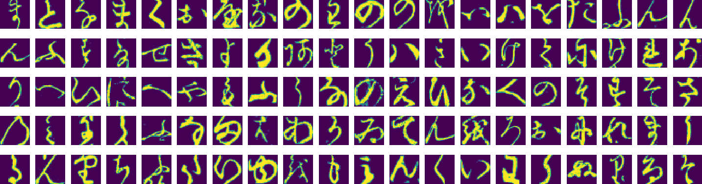</a>

---

### SVHN-Normal
The Street View House Numbers dataset (SVHN) contains 32x32 cropped images of house numbers obtained from Google Street View. There are 73.257 digits for training and 26.032 digits for testing. **Noncommercial** use is allowed only: [see the SVHN website for more information](http://ufldl.stanford.edu/housenumbers/).

```
from extra_keras_datasets import svhn
(input_train, target_train), (input_test, target_test) = svhn.load_data(type='normal')
```

<a href="./assets/svhn-normal.png">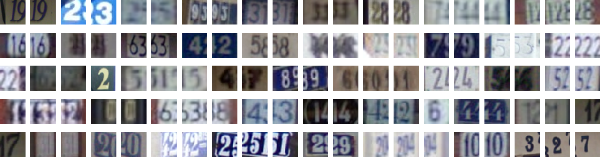</a>

---

### SVHN-Extra
SVHN-Extra extends SVHN-Normal with 531.131 less difficult samples and contains a total of 604.388 digits for training and 26.032 digits for testing. **Noncommercial** use is allowed only: [see the SVHN website for more information](http://ufldl.stanford.edu/housenumbers/).

```
from extra_keras_datasets import svhn
(input_train, target_train), (input_test, target_test) = svhn.load_data(type='extra')
```

<a href="./assets/svhn-extra.png">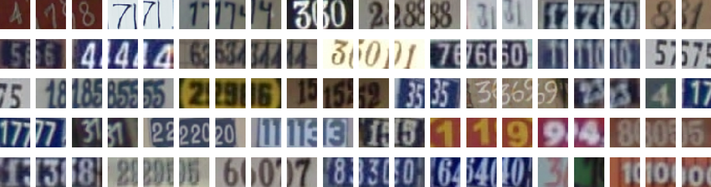</a>

---

### STL-10
The STL-10 dataset is an image recognition dataset for developing unsupervised feature learning, deep learning, self-taught learning algorithms. It contains 5.000 training images and 8.000 testing images, and represents 10 classes in total (airplane, bird, car, cat, deer, dog, horse, monkey, ship, truck).

```
from extra_keras_datasets import stl10
(input_train, target_train), (input_test, target_test) = stl10.load_data()
```

<a href="./assets/stl10.png">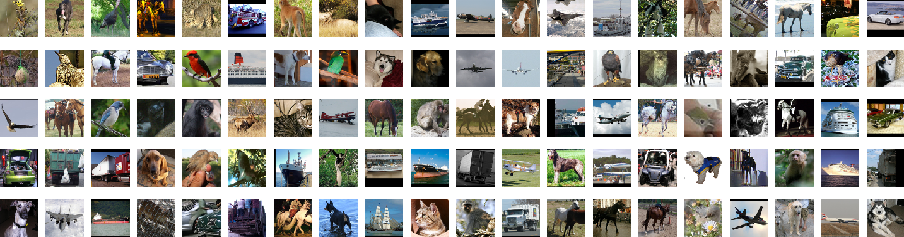</a>

---

### Iris
This is perhaps the best known database to be found in the pattern recognition literature. Fisher's paper is a classic in the field and is referenced frequently to this day. (See Duda & Hart, for example.) The data set contains 3 classes of 50 instances each, where each class refers to a type of iris plant. One class is linearly separable from the other 2; the latter are NOT linearly separable from each other.

Predicted attribute: class of iris plant.

```
from extra_keras_datasets import iris
(input_train, target_train), (input_test, target_test) = iris.load_data(test_split=0.2)
```

<a href="./assets/iris.png">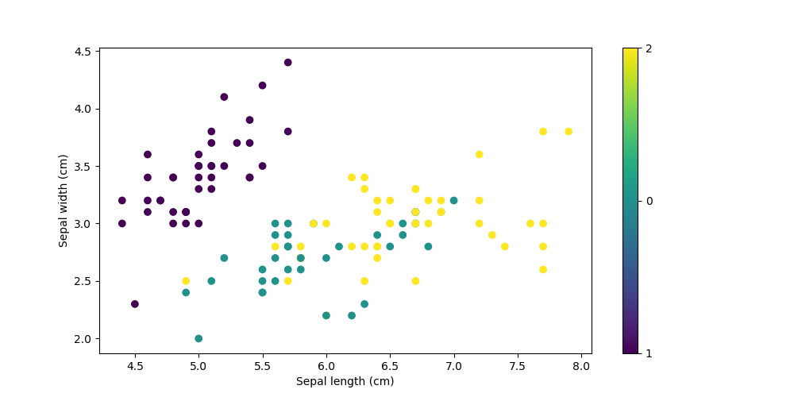</a>

---

## Contributors and other references
* **EMNIST dataset:**
  * Cohen, G., Afshar, S., Tapson, J., & van Schaik, A. (2017). EMNIST: an extension of MNIST to handwritten letters. Retrieved from http://arxiv.org/abs/1702.05373
  * [tlindbloom](https://stackoverflow.com/users/4008755/tlindbloom) on StackOverflow: [loading EMNIST-letters dataset](https://stackoverflow.com/questions/51125969/loading-emnist-letters-dataset/53547262#53547262) in [emnist.py](./emnist.py).
* **KMNIST dataset:**
  * Clanuwat, T., Bober-Irizar, M., Kitamoto, A., Lamb, A., Yamamoto, K., & Ha, D. (2018). Deep learning for classical Japanese literature. arXiv preprint arXiv:1812.01718. Retrieved from https://arxiv.org/abs/1812.01718
* **SVHN dataset:**
  * Netzer, Y., Wang, T., Coates, A., Bissacco, A., Wu, B., & Ng, A. Y. (2011). Reading digits in natural images with unsupervised feature learning. Retrieved from http://ufldl.stanford.edu/housenumbers/nips2011_housenumbers.pdf / http://ufldl.stanford.edu/housenumbers/
* **STL-10 dataset:**
  * Coates, A., Ng, A., & Lee, H. (2011, June). An analysis of single-layer networks in unsupervised feature learning. In Proceedings of the fourteenth international conference on artificial intelligence and statistics (pp. 215-223). Retrieved from http://cs.stanford.edu/~acoates/papers/coatesleeng_aistats_2011.pdf
* **Iris dataset:**
  * Fisher,R.A. "The use of multiple measurements in taxonomic problems" Annual Eugenics, 7, Part II, 179-188 (1936); also in "Contributions to Mathematical Statistics" (John Wiley, NY, 1950).

## License
The licenseable parts of this repository are licensed under a [MIT License](./LICENSE), so you're free to use this repo in your machine learning projects / blogs / exercises, and so on. Happy engineering! 🚀